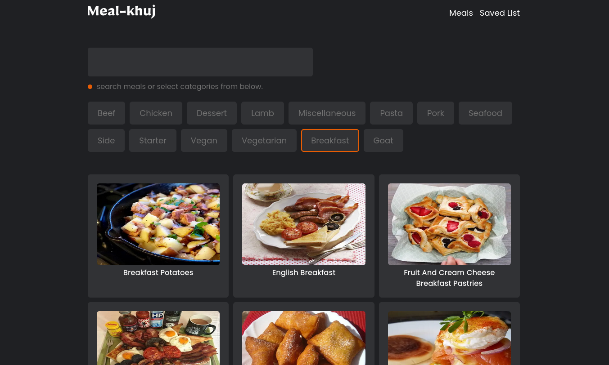

## Meal-khuj

A react (`Next.js` + `React Query`) app, where you can find meals recipe and save your favorite recipe for later.

### Tech Used

- Next.js
- React Query
- Axios
- React-hot-toast

**live preview: [https://meal-khuj.netlify.app](https://meal-khuj.netlify.app)** 
**youtube-tutorial: [https://youtu.be/JtfduKrxRH8](https://youtu.be/JtfduKrxRH8)** 
**live-streams: [twitch](https://www.twitch.tv/collections/_B3PzAnVDxe7BQ)** 
**API used: [themealdb](https://www.themealdb.com/api.php)**

---

Like my works and want to support me?  
you can buy me a coffee 👇

---

## Other projects

📚 [All Web Cifar Projects][wc-projects]

## Feedback

If you have any feedback, please reach out to us at [@web_cifar][wc-ig], or webcifar@gmail.com

## Get Support

For support, join our [Community Group][wc-fb-group].

Happy Coding! ✨🚀

[arfan-ig]: http://instagram.com/shaifarfan08
[wc-ig]: http://instagram.com/web_cifar
[wc-projects]: https://github.com/ShaifArfan/wc-project-tutorials
[wc-fb-group]: https://www.facebook.com/groups/webcifar
